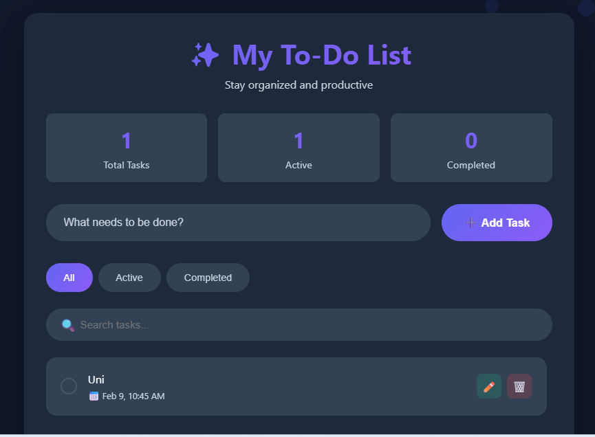
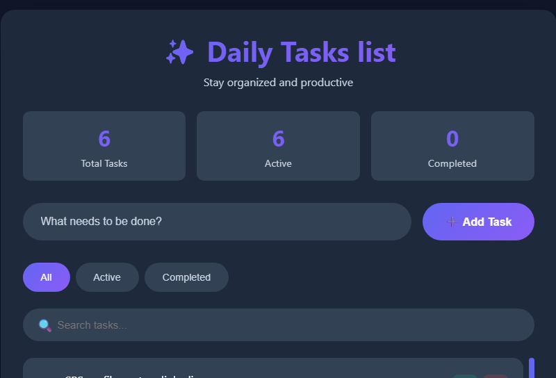
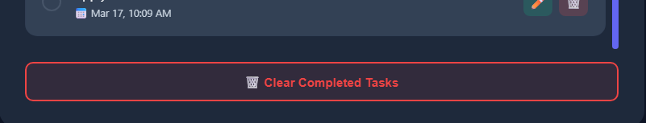

# ✨ Modern To-Do List Web App

A modern, responsive, and interactive To-Do List web application built using **HTML, CSS, and JavaScript**.  
This app helps users manage daily tasks efficiently with features like task tracking, filtering, searching, and editing — all stored locally in the browser.

## 🚀 Features

- ➕ Add new tasks instantly  
- ✅ Mark tasks as completed  
- ✏️ Edit existing tasks  
- 🗑️ Delete tasks  
- 🔍 Search tasks in real time  
- 📂 Filter tasks (All / Active / Completed)  
- 📊 Task statistics (Total / Active / Completed)  
- 💾 Local storage support (data saved in browser)  
- 📱 Fully responsive design  
- 🎨 Modern UI with animations and gradients  

---

## 🛠️ Technologies Used

- **HTML5** – Structure  
- **CSS3** – Styling, layout, animations  
- **JavaScript (ES6)** – Functionality and logic  
- **LocalStorage API** – Data persistence  

---

## 📁 Project Structure

📦 Modern-ToDo-App
┣ 📄 index.html
┣ 📄 README.md

---

## 💻 How It Works

1. Enter a task in the input field.
2. Click **Add Task** or press **Enter**.
3. Manage tasks using:
   - Checkbox → mark complete
   - Edit icon → update task
   - Delete icon → remove task
4. Filter tasks using:
   - All
   - Active
   - Completed
5. Search tasks using the search bar.
6. Completed tasks can be cleared using **Clear Completed Tasks**.

All tasks are stored in **local storage**, so data remains even after refreshing the page.

## 🎯 Learning Outcomes

This project demonstrates:

- DOM manipulation  
- Event handling  
- Object-oriented JavaScript  
- Local storage integration  
- UI/UX design principles  
- Responsive web development  

---

## 📌 Future Improvements

- Drag & drop task reordering  
- Dark/light theme toggle  
- Backend integration (Node.js / Firebase)  
- User authentication  
- Deadline & reminders  

---

## 👨‍💻 Author

**Ali Raza Baloch**  
Software Engineering Student | Frontend Developer  

- Passionate about web development and building user-friendly interfaces  
- Skilled in HTML, CSS, JavaScript, C++, and Python  

---

## ⭐ Support

If you like this project:

- Star ⭐ the repository  
- Fork 🍴 it  
- Share 📢 with others  

---
